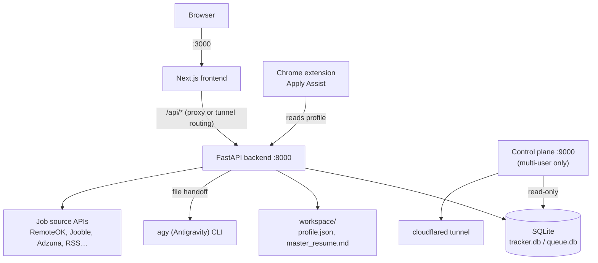

# Facet

Facet tailors one resume, cover letter, and recruiter pitch at a time from
your real background — for one person cutting their own job applications, or
a small group running it together behind a Cloudflare Tunnel.

## The honesty constraint

Everything Facet writes traces back to a single file you control:
`workspace/profile.json`, built from your resume and reviewed by you before
anything is generated from it. The tailoring pipeline never invents a skill,
employer, title, date, or accomplishment — it can only select and phrase what
is already there. A **truthfulness mode** on `/tailor` controls how far it
goes in surfacing real experience: *strict* claims only what's explicit;
*infer adjacent skills* may additionally claim a skill genuinely implied by a
real accomplishment (e.g. "REST APIs" from a bullet about an API-backed
dashboard), always labelled separately as inferred so you can cut it before
anything goes out. Employers, titles, and dates are never touched by either
mode. This constraint is the reason the tool exists — a tailored application
that quietly lies is worse than a generic one.

## Vocabulary

| Term | Meaning |
|---|---|
| **Stone** | Your real background — `profile.json`, extracted from your resume. The only source of truth; the AI never invents beyond it. |
| **Rough** | The pool of job postings gathered for you, from public APIs and feeds you subscribed to. |
| **Facet** | One application — resume, cover letter, recruiter pitch — tailored for one posting. |
| **Cabinet** | The record of everywhere you applied, with status, contacts, and interviews. |

## What it does

- **Imports** a resume (PDF/DOCX), mechanically parses it to markdown for you
  to review and correct, then runs an AI extraction pass into `profile.json`
  — the fixed scaffold every Facet is built from afterward.
- **Gathers postings** into the Rough from keyless public job APIs (RemoteOK,
  Arbeitnow, Jobicy, Himalayas) plus optional keyed aggregators (Jooble,
  Adzuna) and RSS/job-alert feeds you subscribe to yourself, on a 6-hour
  poll. Search and filter by role, company, skill, location, remote/on-site,
  date, source, employment type, salary, and match score against your Stone.
- **Cuts a Facet**: paste or promote a posting, pick a truthfulness mode, and
  get a Clarity Score, matched vs. inferred vs. missing skills, tailored
  bullets, a cover letter, and a recruiter pitch — queued and polled, nothing
  final until you've reviewed it.
- **Tracks it in the Cabinet**: mark **Set This Facet** once you've actually
  applied; the dashboard and charts follow from there.
- **Fills forms it never submits**: `extension/` is a Chrome extension that
  recognizes fields on Greenhouse/Lever postings and fills them in a tab you
  opened yourself. There is no submit path in its code.
- **Reports its own health**: `/status` runs every subsystem check live —
  database, sources, the AI engine, document export, per-endpoint latency —
  and answers in a couple of seconds with no cached or assumed state.
- Runs single-user with no login, or multi-user behind a Cloudflare Tunnel
  with its own email/password sign-in, per-user databases, and an admin
  portal for invites and backups — see [Deployment](#deployment).

## Quickstart (single machine, single user)

You need **Python 3.12** and **Node.js 22.6+** on `PATH`; the launcher
installs everything else into `backend/.venv` and `frontend/node_modules`.

```bash
git clone <this-repo> Facet
cd Facet
./start.sh              # macOS / Linux
start.bat                # Windows
python run.py            # any platform, directly
```

First run creates `backend/.venv`, installs the backend, `npm install`s the
frontend, initializes `data/tracker.db`, builds the frontend, then serves the
backend (FastAPI, `:8000`) and frontend (Next.js, `:3000`). Ctrl+C stops
both. Open `http://localhost:3000` — the landing page explains the product
and never gates you behind a password before you've seen it.

| Flag | What |
|---|---|
| *(none)* | Production build, then serve. The default. |
| `--dev` | `uvicorn --reload` + `next dev`, for working on Facet itself. |
| `--build` | Discard the previous build and rebuild before serving. |
| `--setup` | Install dependencies and exit. |

Import your resume to get started — nothing works from an empty Stone.
[`WeasyPrint`](https://weasyprint.org) needs native Pango/Cairo libraries for
PDF/DOCX export, and the `agy` (Antigravity) CLI is required for AI features
(tailoring, profile extraction); both degrade gracefully and are reported on
`/status` rather than crashing the app. `docker compose up --build` also
works — see `README` prior revisions or `deploy/README.md` for the
containerized path.

## Architecture



The frontend never talks to the backend directly from the browser in a
hosted deployment — Cloudflare routes `/api/*` to the backend and everything
else to the frontend, so no API host is baked into the JS bundle and nothing
is cross-origin. In Docker, Next proxies `/api/*` to the backend over the
compose network instead. The AI features shell out to the `agy` CLI through a
file-handoff pattern (`backend/services/agy_runner.py`) because `agy -p`
produces nothing usable on stdout outside a real terminal. In multi-user
mode, `backend/control/` is a second FastAPI app — the admin portal — that
owns user provisioning, backups, and the generated Cloudflare ingress; it
reads user databases read-only and never writes to them.

## Deployment

Single-user, local: `python run.py` or `docker compose up --build` — see
above. Multi-user, hosted behind a Cloudflare Tunnel with per-user SQLite
databases, email/password auth, and an admin portal: see
[`deploy/README.md`](deploy/README.md) for the architecture and
[`docs/setup.md`](docs/setup.md) for the full walkthrough from a bare VM.
[`docs/runbook.md`](docs/runbook.md) covers what to do when something is
wrong once it's running.

## Checks

No test framework — each non-trivial module carries one runnable check:

```bash
backend/.venv/bin/python -m services.job_sources     # parsing/normalizing, offline
backend/.venv/bin/python -m services.matching        # match scoring
backend/.venv/bin/python -m services.logging_setup   # ring buffer + metrics
backend/.venv/bin/python -m services.health          # every status check
backend/.venv/bin/python scripts/check_all.py        # every suite + self-check, one command
cd frontend && npm run check                          # formatting, api cache, design system, interface
cd frontend && npx tsc --noEmit && npm run lint && npm run build
node extension/check.mjs                               # manifest, permissions, no-submit gate
```

`scripts/check_all.py` discovers `scripts/test_*.py` by filename. See
`CONTEXT.md` for the full list of per-module checks, including the
multi-user and control-plane ones.

## Non-goals

- **Never scrapes a job board.** Postings arrive only through a provider's
  own public API, an aggregator's own API, or a feed you subscribed to
  yourself — the same category of access as an email newsletter.
- **Never auto-submits an application.** The extension's selector-map format
  has no `submit_selector` field, and nothing in its content script calls
  `.click()` or dispatches a submit event on a final control. It fills what
  it recognizes and stops.
- **No telemetry.** Nothing phones home. Job source API keys live in
  `data/settings.json` or environment variables and are only ever sent to
  the provider they belong to.

## Project layout

```
backend/            FastAPI app: routers/, services/, control/ (multi-user admin), scripts/
frontend/            Next.js app: src/app/ (pages), src/components/, src/lib/
extension/           Chrome MV3 "Apply Assist" — fills forms, never submits
templates/           Resume/cover-letter templates used by document generation
workspace/           Your Stone: profile.json, master_resume.md (gitignored)
data/                tracker.db, settings.json, feeds.json, logs/, exports/ (gitignored)
docs/                setup.md, runbook.md, perf.md, ui-audit.md
deploy/              install.sh, publish.sh, systemd units, deployment reference
run.py, start.sh, start.bat   Launcher — see Quickstart
CONTEXT.md           Orientation brief for an agent working on this codebase
AUTONOMY.md          Standing prompt for autonomous improvement passes
CHANGELOG.md         Dated log of what changed and why
```
